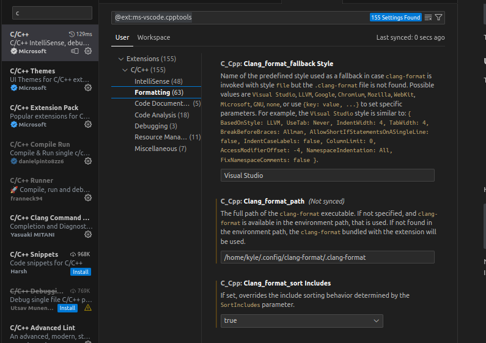

# Formatting and Static Analysis in C
Last updated: August 2023

## Table of Contents
1. [Introduction](#introduction)
2. [Tools Covered:](#tools-covered)
3. [clang-format](#clang-format)
4. [Include-What-You-Use](#include-what-you-use)
5. [Valgrind](#valgrind)
6. [Helgrind](#helgrind)
7. [fsanitize address](#fsanitize-address)
8. [fsanitize thread](#fsanitize-thread)
9. [Author](#author)


## Introduction

Welcome to this class on **formatting files and static analysis tools in C**. This class was designed to help you enchance your knowledge about vital tools and techniques used in modern C development.

This class will guide you through installation, understanding, and offer examples of several essential tools that can help streamline your coding process, catch bugs, and overall make your code safer and more efficient.

**`NOTE: All examples and installations were performed on Ubuntu 22.04, July  2023. Versions and installations may differ depending on your operating system and environment.`**

## Tools Covered:

- **.clang-format**: This versatile tool auto-formats C code to make it cleaner and more readable, ensuring consistent code style across your project.

- **include-what-you-use**: Developed by Google, this tool suggests #include corrections for C and C++ source files, managing your code's dependencies effectively.

- **valgrind**: A dynamic analysis tools framework, used particularly for memory checking, detecting memory leaks, and other related problems.

- **helgrind**: A reliable thread error detector, it identifies common errors that occur in multithreaded code.

- **fsanitize=address**: Part of the Clang sanitizer suite, it detects address-related issues in your code like out-of-bounds accesses or use-after-free errors.

- **fsanitize=thread**: Another component of the Clang sanitizer suite, it is used to catch data races in your code, ensuring the concurrency safety of your programs.

## clang-format

### What is .clang-format?
A .clang-format file is a configuration file used by the Clang Format, a tool that automatically formats C/C++/Obj-C code. This tool is part of the Clang project, an open-source compiler for the C family of programming languages.

The .clang-format file specifies a set of style options indicating how the Clang Format tool should format code. It allows developers to maintain consistent coding styles across different parts of their projects or even across different projects.

These style options can control various aspects of formatting, such as indentation, spacing, alignment, and order of includes, to name a few. You can specify these options directly in the .clang-format file, or use predefined coding styles like LLVM, Google, Chromium, Mozilla, or WebKit.

A .clang-format file will help you keep you code more readable and maintainable by enforcing a consistent coding syle.

**`NOTE: There is an example .clang-format file in this classes root directory. The formatting is focused on BARR-C formatting style.`

### Requirements to use a .clang-format on Ubuntu 22.04 VS Code
**Install clang-format**
- First, check to see if you have clang-format already installed by opening a terminal and inputting the following command:
```
clang-format --version
```
- If it is already installed, you will see something like this:
```
(main) $ clang-format --version
Ubuntu clang-format version 14.0.0-1ubuntu1.1
```

To continue with installing clang, which includes clang-format, follow the steps below:

```
sudo apt update
sudo apt install clang
```

To check if installation was successful, you can check the version again.

### Using the .clang-format file with VS Code
There are a few options to use your .clang-format file with your project files.  
1. You can place the .clang-format in your root directory and use it within your projects repository.

2. You can place the .clang-format in your ~/.config/ folder and use it throughout your file system.

- I created a clang-format folder in my ~/.config/ folder and copied my .clang-format file. This will allow you to have a consitent path to your .clang-format file.

Here are some simple steps to complete the second option:
```
mkdir ~/.config/clang-format
cp .clang-format ~/.config/clang-format/
ls ~/.config/clang-format
```

Now that the .clang-format file is located in our ~/.config folder, we can update VS Code, or IDE of your choice, to use the formatting specified when linting/saving our files.

1. Open VS Code.
2. Open command pallette by entering: `Cmd+Shift+p`  
3. I am updating the C/C+ extension settings.  
    1. Go to externsions and find the C/C+ extension.
    2. Select the settings wheel to open extensions settings.
    3. Navigate to formatting and update the path to your .clang-format file.
    4. Go through the remaining settings and adjust to your liking. I chose to lint on save and other convenience-related options. 

Example photo of what my VS Code settings look like:


### Clang Format File Conclusion
There are many options when using .clang-format and you can explore all there is to offer by reading the man page:
```
man clang-format
```

Or by reading the --help options:
```
clang-format --help
```
You can use this formatting file within your current repository with single files, but the focus on this class was to setup VS Code to use the file and format your code from the IDE.

If there are any issues encountered because of misinformation from this class, please let me know so I can fix the class. 

## Include-What-You-Use
`TODO: Update Class`

## Valgrind
`TODO: Update Class`

## Helgrind
`TODO: Update Class`

## fsanitize address
`TODO: Update Class`

## fsanitize thread
`TODO: Update Class`

## Author
CW2 Kyle Spicer  

Email:  
- kyledspicer@gmail.com  
- kyle@kdspicer.com  
